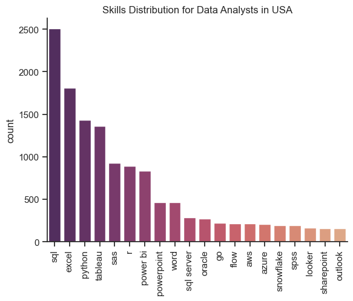

# Overview
Welcome to my analysis of the data job market, focusing on data analyst roles. This project was created out of a desire to navigate and understand the job market more effectively. It delves into the top-paying and in-demand skills to help find optimal job opportunities for data analysts.

The data sourced from Luke [Barousse's Python Course](https://lukebarousse.com/python) which provides a foundation for my analysis, containing detailed information on job titles, salaries, locations, and essential skills. Through a series of Python scripts, I explore key questions such as the most demanded skills, salary trends, and the intersection of demand and salary in data analytics.

# The Questions
Below are the question I want to answer in my project:
1. What are the skills most in demand for the top 3 most popular data roles?
2. How are in-demand skills trending for Data Analysts?
3. How well do jobs and skills pay for Data Analysts?
4. What are the optimal skills for data analysts to learn? (High Demand AND High Paying)

# Tools I Used
For my deep dive into the data analyst job market, I harnessed the power of several key tools:

- **Python:** The backbone of my analysis, allowing me to analyze the data and find critical insights.I also used the following Python libraries:
    - **Pandas Library:** This was used to analyze the data.
    - **Matplotlib Library:** I visualized the data.
    - **Seaborn Library:** Helped me create more advanced visuals.
- **Jupyter Notebooks:** The tool I used to run my Python scripts which let me easily include my notes and analysis.
- **Visual Studio Code:** My go-to for executing my Python scripts.
- **Git & Github:** Essential for version control and sharing my Python code and analysis, ensuring collaboration and project tracking.

# Data Preparation and Cleanup
This section outlines the steps taken to prepare the data for analysis, ensuring accuracy and usability.

## Import & Clean Up Data
I start by importing necessary libraries and loading the dataset, followed by initial data cleaning tasks to ensure data quality.

```py
import pandas as pd
import matplotlib.pyplot as plt
import seaborn as sns
from ast import literal_eval

df = pd.read_csv('../data_samples/data_jobs.csv')

# Data Cleaning
df['job_posted_date'] = pd.to_datetime(df['job_posted_date']).dt.normalize()

def take_list(str_list):
    if pd.notna(str_list):
        return literal_eval(str_list)
    return str_list

df['job_skills'] = df['job_skills'].apply(take_list)

df
```

## Filter US Jobs
To focus my analysis on the U.S. job market, I apply filters to the dataset, narrowing down to roles based in the United States.

```py
df_US = df[df['job_country'] == 'United States']
```

# The Analysis
Each Jupyter notebook for this project aimed at investigating specific aspects of the data job market. Here’s how I approached each question:

## 1. What is the most demanded skills for the top 3 most popular data roles ?

To find the most demanded skills for the top 3 most popular data roles. I filtered out those positions by which ones were the most popular, and got the top 10 skills for these top 3 roles. This query highlights the most popular job titles and their top skills, showing which skills I should pay attention to depending on the role I'm targeting.

View my notebook with detailed steps here: [skills_demand.ipynb](./skills_demand.ipynb)


### Analysis Job counts
I took a look at the count of these three jobs in our dataset

```py
# What are the skills most in demand for the top 3 most popular data roles ?
jobs = ['Data Analyst', 'Data Engineer', 'Data Scientist']
# First let's find the 3 most popular roles
most_popular = df_city[df_city['job_title_short'].isin(jobs)]['job_title_short'].value_counts().to_frame()

# Let's plot it
ax = sns.barplot(data=most_popular, x='job_title_short', y='count', hue='job_title_short', palette='bright')

ax.set_title('Most 3 Popular Data Jobs Count')
ax.set_xlabel('')

# Format the x-axis
ax.yaxis.set_major_formatter(plt.FuncFormatter(lambda y, _: f'{int(y/1000)}K'))

# Format each label using a lambda
for c in ax.containers:
    ax.bar_label(
        c,
        labels=[f"{int(bar.get_height()/1000)}K" for bar in c]  # Custom formatting
    )
```

### Result


***

### Analysis & Visualize Data
Now let's take a look at the most 10 in-demand skills for these different jobs

```py
from typing import List


def find_skills_for(df: pd.DataFrame, job: str, skills_count: int, ax: plt.Axes=None) -> pd.DataFrame:
    # Pivot
    pivoted = df[df['job_title_short'] == job].pivot_table(index='job_skills', aggfunc='size', sort=False)
    # Extract top 10 skills
    skills = pivoted.sort_values(ascending=False).head(skills_count).to_frame('Count')
    if ax is not None:
        sns.barplot(data=skills, x='Count', y='job_skills', ax=ax, hue='job_skills', palette='flare_r')
    else:
        ax = sns.barplot(data=skills, x='Count', y='job_skills', hue='job_skills', palette='flare_r')
    ax.set_ylabel('')
    ax.set_title(f'Top {skills_count} In-Demand Skills For {job} ')
    return skills


# Select the roles
df_jobs = df_city[df_city['job_title_short'].isin(jobs)].reset_index(drop=True)

# Explode
df_final = df_jobs.explode('job_skills')

# Prepare the plots
fig, axs = plt.subplots(3, 1, figsize=(9, 10))

# To select the highest skills count to make plots the same x-axis values
skills_df:List[pd.DataFrame] = []

# Plot
for i, job in enumerate(jobs):
    skills_df.append(find_skills_for(df_final, job, 10, axs[i]))

max_skills_count = [skill['Count'].max() for skill in skills_df]

for ax in axs:
    # Fix the x-axis
    ax.set_xlim(0, max(max_skills_count) + 5000)
    # Add label for each bar
    for container in ax.containers:
        ax.bar_label(container, [f'  {int(bar.get_width() / 1000)}K' for bar in container])

# Fix the layout
fig.tight_layout(h_pad=2)
```

### Result


### Analysis & Percentages
To make it more clear. Let's see what is the percentage of appearing the skill in a job posting that require it

```py
def find_percentage_skills_for(df: pd.DataFrame, job: str, skills_count: int, total_jobs: int, ax: plt.Axes=None) -> pd.DataFrame:
    # Pivot
    pivoted = df[df['job_title_short'] == job].pivot_table(index='job_skills', aggfunc='size', sort=False)
    # Extract top 10 skills
    skills = pivoted.sort_values(ascending=False).head(skills_count).to_frame('Count')
    skills['Count'] = skills['Count'].apply(lambda num: round((num/total_jobs) * 100, 2))
    if ax is not None:
        sns.barplot(data=skills, x='Count', y='job_skills', ax=ax, hue='job_skills', palette='flare_r')
    else:
        ax = sns.barplot(data=skills, x='Count', y='job_skills', hue='job_skills', palette='flare_r')
    ax.set_ylabel('')
    ax.set_xlabel('')
    ax.set_title(f'Likelihood of Top {skills_count} In-Demand Skills For {job} ')
    ax.set_xlim(0, 80)
    
    # Add percentage
    for container in ax.containers:
        ax.bar_label(container, [f'  {bar.get_width()}%' for bar in container])
    
    return skills


# Prepare the plots
fig, axs = plt.subplots(3, 1, figsize=(9, 10))

# Plot
for i, job in enumerate(jobs):
    find_percentage_skills_for(df_final, job, 10, most_popular.loc[job]['count'], axs[i])

# Fix layout
fig.tight_layout(w_pad=4)
```

### Result


### Insights

- Python is a veratile skill, Highly demanded across all three roles, but for most prominently for Data Scientists *(72%)* and Data Engineer *(65%)*.
- SQL is the most requested skill for Data Anaylsts and DAta Scientists, with it in over half the job postings for both roles. For Data Engineers, Python is the most sought-after skill. appearing in *(68%)* of job postings.
- Data Engineers require more specialized technical skills (AWS, Azure, Spark) compared to Data Anaylsts and DAta Scientists who are expected to be proficient in more general data management and analysis tools (Excel, Tableau).

## 2. How are in-demand skills trending for Data Analysts
To find how skills are trending in 2023 for Data Analysts, I filtered data analyst positions and grouped the skills by the month of the job postings. This got me the top 5 skills of data analysts by month, showing how popular skills were throughout 2023.

View my notebook with detailed steps here: [skills_trend](./skills_trend.ipynb)

### Visualize data for trending skills by jobs count
let's take a look at the number of jobs I have and see the trend of skills throw 2023

```py
# Now to plot it I need to make it long format
df_plot = df_pivoted.reset_index().melt(
    id_vars="job_skills", 
    var_name="month", 
    value_name="count"
)

ax = sns.lineplot(data=df_plot, x='month', y='count', hue="job_skills")
sns.despine()


for label in ax.get_xticklabels():
    label.set_rotation(90)

ax.set_ylabel('Count of Jobs')
ax.set_xlabel('')
ax.legend(title='Skills')
ax.set_title('Skills Trending By Jobs Count')

```

### Result


### Visualize data for trending skills by jobs count (liklehood)
Again to make it more clear. Let's see how many the skills appeare in the month

```py
# To get the percentages I need to know how many job I have per month (Data Anaylsis)

jobs_mo = df_city.groupby('job_posted_month_name').agg('size').to_frame('count')

# Get the count of the skill divide it by the total jobs count 
# of data anaylst in that month
def find_percentage(row):
    return round(row['count'] / jobs_mo.loc[row['month']]['count'] * 100, 2)


df_plot['percentage'] = df_plot.apply(axis=1, func=find_percentage)

# Let's plot
ax = sns.lineplot(data=df_plot, x='month', y='percentage', hue="job_skills")
sns.despine()
for label in ax.get_xticklabels():
    label.set_rotation(90)

# Move the legend outside the plot
ax.legend(bbox_to_anchor=(1.05, 1), loc='upper left')
ax.set_title('Trending Top Skills for Data Anaysis in The USA')
ax.set_xlabel('')
ax.set_ylabel('Likelihood in Job Posting')

# Make the axis cleaner
ax.yaxis.set_major_formatter(plt.FuncFormatter(lambda y, _: f'{int(y)}%'))
```

### Result


### Insights
- SQL remains the most consistently demanded skill throughout the year, although it shows a gradual decrease in demand.
- Excel experienced a significant increase in demand starting around Septemeber, surpassing both Python and Tableau by the end of the year.
- Both Python and Tableau show relatively stable demand thoughout the year with some fluctuations but remain essential skills for data analysts.

## 3. How well do jobs and skills pay for Data Analysts ?
To identify the highest-paying roles and skills, I only got jobs in the United States and looked at their median salary. But first I looked at the salary distributions of common data jobs like Data Scientist, Data Engineer, and Data Analyst, to get an idea of which jobs are paid the most.

View my notebook with detailed steps here: [skills_demand.ipynb](./salary_analysis.ipynb)

### Job salaries
First let's see the distribution of the jobs in our dataset to know the nature of it

```py
# Let's first see the distruibution of the jobs in our dataset (For US)
job_dist = df_US['job_title_short'].value_counts().to_frame()

# I used the bar plot because my data is nominal
# plot it
ax = sns.barplot(data=job_dist, x='job_title_short', y='count', hue='job_title_short', palette='dark:b')
sns.set_theme(style='ticks')
sns.despine()

for label in ax.get_xticklabels():
    label.set_rotation(90)

ax.set_xlabel('')
ax.set_title('Distribution of The Jobs In The Dataset')
```

### Result
As I can see the plot is skewed to the right meaning that the jobs are not distributed in a normal way. So this will help us making insights correctly and avoid missleading


### Analysis and distribution of salaries for data roles
As I saw it's skewed to the right. Now if I want to know what is the most paid skill for example the sum won't be a good option and may lead to wrong insights. This why I choose median

```py
# First take the top 6 roles
job_roles = job_dist.iloc[:6].index.to_list()

# Takes the jobs and salaries
df_plot = df_US[df_US['job_title_short'].isin(job_roles)]

job_order = df_plot.groupby('job_title_short')['salary_year_avg'].median().sort_values(ascending=False)

ax = sns.boxplot(data=df_plot, x='salary_year_avg', y='job_title_short', order=job_order.index)
sns.despine()

ax.get_xaxis().set_major_formatter(plt.FuncFormatter(lambda x, _: f'${int(x/1000)}K'))
ax.set_xlim(0, 6e5)
ax.set_title('Salary Distributions of Data Jobs in USA')
ax.set_ylabel('')
ax.set_xlabel('Yealry Salary (USD)')
```
### Result


### Insights
- There's a significant variation in salary ranges across different job titles. Senior Data Scientist positions tend to have the highest salary potential, with up to $600K, indicating the high value placed on advanced data skills and experience in the industry.

- Data Scientist and Data Engineer have a lot of outliers but they aren't far from the third quarter Q3 that seem valid for upper range salaries and that's because of the roles are senior-level, specialized, or high-location

- The median salaries increase with the seniority and specialization of the roles. Senior roles (Senior Data Scientist, Senior Data Engineer) not only have higher median salaries but also larger differences in typical salaries, reflecting greater variance in compensation as responsibilities increase.

### Highest Paid & Most Demanded Skills for Data Analysts

Next, I narrowed my analysis and focused only on data analyst roles. I looked at the highest-paid skills and the most in-demand skills. I used two bar charts to showcase these.

### Skill distribution
Before I make any insights about skills. I have to know distribution of them throw the count of Data Analysts jobs

```py
# Analyze skills pay for data analysts

df_US_DA = df_US[df_US['job_title_short'] == 'Data Analyst']

df_US_DA = df_US_DA.dropna(subset='salary_year_avg')

# Explode the skills
df_exploded = df_US_DA.explode('job_skills')

# Let's see the distribution of the skills for data analysts
df_dist = df_exploded['job_skills'].value_counts().to_frame()

# plot it
ax = sns.barplot(data=df_dist.iloc[:20], x='job_skills', y='count', hue='job_skills', palette='flare_r')
sns.despine()

for label in ax.get_xticklabels():
    label.set_rotation(90)

ax.set_xlabel('')
ax.set_title('Skills Distribution for Data Analysts in USA')
```
### Result


As I can see the skewed to the right (I took a part of the skills because they are going to 1 over time and there are a lot of them so to make the plot more clear)

### Skill Pay Analysis
Now I want to compare the pay for each salary and I choose the median because of he reason I talked about

```py
# For the same reason I will look for median to know the highest paid skills
df_final = df_exploded.groupby('job_skills')['salary_year_avg'].agg(['size', 'median'])

# Most paid skills
df_skills_most_paid = df_final.sort_values(by='median', ascending=False).iloc[:10]

# Most in-Demand skills
df_skills_most_demand = df_final.sort_values(by='size', ascending=False).iloc[:10].sort_values(by='median', ascending=False)

# Just for less code
li_df = [df_skills_most_demand, df_skills_most_paid]

da = {
    0: {
        'title': 'Most 10 in-Demand Skills For Data Analysis in USA',
    },
    1: {
        'title': 'Most 10 Paid Skills For Data Analysis in USA',
    }
}

# Prepare the subplots
fig, axs = plt.subplots(2, 1, figsize=(10, 8))

# Adjust x-axis
for i, ax in enumerate(axs):
    # The plot
    sns.barplot(data=li_df[i], x='median', y='job_skills', ax=axs[i], hue='job_skills', palette='flare_r')
    
    # Format the x-axis
    ax.get_xaxis().set_major_formatter(plt.FuncFormatter(lambda x, _: f'${int(x/1000)}K'))

    ax.set_title(da[i]['title'])
    ax.set_xlabel('Median Salary (USD)')
    ax.set_ylabel('')
    ax.set_xlim(0, 2e5)
    
    # print the real value next to the bar
    for container in ax.containers:
        ax.bar_label(container, [f'  ${int(bar.get_width() / 1000)}K' for bar in container])


# Remove the left and top sides of the plots
sns.despine()

# Adjust the figure
fig.tight_layout(h_pad=2)
```

### Result


### Insights

- The top graph shows specialized technical skills like dplyr, Bitbucket, and Gitlab are associated with higher salaries, some reaching up to $200K, suggesting that advanced technical proficiency can increase earning potential.

- The bottom graph highlights that foundational skills like Excel, PowerPoint, and SQL are the most in-demand, even though they may not offer the highest salaries. This demonstrates the importance of these core skills for employability in data analysis roles.

- There's a clear distinction between the skills that are highest paid and those that are most in-demand. Data analysts aiming to maximize their career potential should consider developing a diverse skill set that includes both high-paying specialized skills and widely demanded foundational skills.

- As I said there is no overlap between the top 10 most in-demand skills and the top 10 most highly paid skills. This suggests that skills with high demand are not necessarily the ones commanding the highest salaries, potentially due to higher supply or lower specialization.

## 4. What are the most optimal skills to learn for Data Analysts?

To identify the most optimal skills to learn ( the ones that are the highest paid and highest in demand) I calculated the percent of skill demand and the median salary of these skills. To easily identify which are the most optimal skills to learn.

View my notebook with detailed steps here: [optimal_skills.ipynb](./optimal_skills.ipynb)

### Visualize Data

```py
from adjustText import adjust_text

# Plot
ax = sns.scatterplot(data=df_skills, x='likelihood', y='median_salary', hue='likelihood', palette='flare', legend=False)

# Prepare the texts
txts = []

for i, skill in enumerate(df_skills.index):
    txts.append(ax.text(x=df_skills.loc[skill]['likelihood'], y=df_skills.loc[skill]['median_salary'], s=f' {skill}'))

adjust_text(txts, arrowprops=dict(arrowstyle="-", color='red', lw=1))

ax.set_title('Top 10 Optimal Skills For Data Analysis Jobs In USA')
ax.get_yaxis().set_major_formatter(plt.FuncFormatter(lambda y, _: f'${int(y/1000)}K'))
ax.get_xaxis().set_major_formatter(plt.FuncFormatter(lambda x, _: f'{int(x)}%'))
ax.set_ylabel('Yearly Median Salary (USD)')
ax.set_xlabel('Percent of Data Anaylsis Jobs')

sns.despine()
```

### Result


A scatter plot visualizing the most optimal skills (high paying & high demand) for data analysts in the US.

### Insights:
- The skill Oracle appears to have the highest median salary of nearly $97K, despite being less common in job postings. This suggests a high value placed on specialized database skills within the data analyst profession.

- More commonly required skills like Excel and SQL have a large presence in job listings but lower median salaries compared to specialized skills like Python and Tableau, which not only have higher salaries but are also moderately prevalent in job listings.

- Skills such as Python, Tableau, and SQL Server are towards the higher end of the salary spectrum while also being fairly common in job listings, indicating that proficiency in these tools can lead to good opportunities in data analytics.

### Visualizing Different Techonologies
Let's visualize the different technologies as well in the graph. I'll add color labels based on the technology (e.g., {Programming: Python})

### Visualize Data
```py
# It's time for plot
from adjustText import adjust_text

# Plot
ax = sns.scatterplot(data=df_skills, x='likelihood', y='median_salary', hue='skill_types')

# Move the legend out of the plot. Add title
ax.legend(bbox_to_anchor=(1, 1), loc='upper left', title='Technology')

# Prepare the texts
txts = []

for i, skill in enumerate(df_skills.index):
    txts.append(ax.text(x=df_skills.loc[skill]['likelihood'], y=df_skills.loc[skill]['median_salary'], s=f' {skill}'))

adjust_text(txts, arrowprops=dict(arrowstyle="-", color='red', lw=1))

ax.set_title('Most Optimal Skills For Data Analysis Jobs In USA')
ax.get_yaxis().set_major_formatter(plt.FuncFormatter(lambda y, _: f'${int(y/1000)}K'))
ax.get_xaxis().set_major_formatter(plt.FuncFormatter(lambda x, _: f'{int(x)}%'))
ax.set_ylabel('Yearly Median Salary (USD)')
ax.set_xlabel('Percent of Data Anaylsis Jobs')

sns.despine()
```

### Result

A scatter plot visualizing the most optimal skills (high paying & high demand) for data analysts in the US with color labels for technology.

### Insights:
- The scatter plot shows that most of the programming skills (colored blue) tend to cluster at higher salary levels compared to other categories, indicating that programming expertise might offer greater salary benefits within the data analytics field.

- The database skills such as Oracle and SQL Server, are associated with some of the highest salaries among data analyst tools. This indicates a significant demand and valuation for data management and manipulation expertise in the industry.

- Analyst tools, including Tableau and Power BI, are prevalent in job postings and offer competitive salaries, showing that visualization and data analysis software are crucial for current data roles. This category not only has good salaries but is also versatile across different types of data tasks.

# What I Learned
Throughout this project, I deepened my understanding of the data analyst job market and enhanced my technical skills in Python, especially in data manipulation and visualization. Here are a few specific things I learned:
- **Advanced Python Usage:** Utilizing libraries such as Pandas for data manipulation, Seaborn and Matplotlib for data visualization, and other libraries helped me perform complex data analysis tasks more efficiently.

- **Data Cleaning Importance:** I learned that thorough data cleaning and preparation are crucial before any analysis can be conducted, ensuring the accuracy of insights derived from the data.

- **Strategic Skill Analysis:** The project emphasized the importance of aligning one's skills with market demand. Understanding the relationship between skill demand, salary, and job availability allows for more strategic career planning in the tech industry.

# Insights
This project provided several general insights into the data job market for analysts:
- **Skill Demand and Salary Correlation:** There is a clear correlation between the demand for specific skills and the salaries these skills command. Advanced and specialized skills like Python and Oracle often lead to higher salaries.

- **Market Trends:** There are changing trends in skill demand, highlighting the dynamic nature of the data job market. Keeping up with these trends is essential for career growth in data analytics.

- **Economic Value of Skills:** Understanding which skills are both in-demand and well-compensated can guide data analysts in prioritizing learning to maximize their economic returns.

# Challenges I Faced
This project was not without its challenges, but it provided good learning opportunities:

- **Data Inconsistencies:** Handling missing or inconsistent data entries requires careful consideration and thorough data-cleaning techniques to ensure the integrity of the analysis.

- **Complex Data Visualization:** Designing effective visual representations of complex datasets was challenging but critical for conveying insights clearly and compellingly.

- **Balancing Breadth and Depth:** Deciding how deeply to dive into each analysis while maintaining a broad overview of the data landscape required constant balancing to ensure comprehensive coverage without getting lost in details.

# Conclusion
This exploration into the data analyst job market has been incredibly informative, highlighting the critical skills and trends that shape this evolving field. The insights I got enhance my understanding and provide actionable guidance for anyone looking to advance their career in data analytics. As the market continues to change, ongoing analysis will be essential to stay ahead in data analytics. This project is a good foundation for future explorations and underscores the importance of continuous learning and adaptation in the data field.